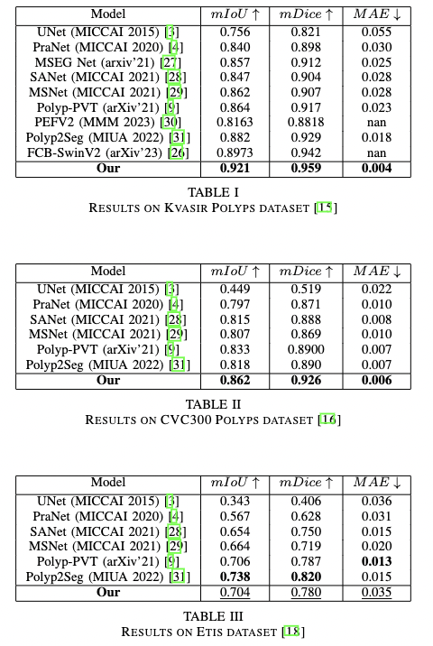

# Meta-Polyp: a baseline for efficient Polyp segmentation, CBMS 2023 

This repo is the official implementation for paper:

Meta-Polyp: a baseline for efficient Polyp segmentation.

<b>Author:</b> <b>Quoc-Huy Trinh</b>

In the IEEE 36th International Symposium on Computer Based Medical Systems (CBMS) 2023.

Detail of each model modules can be found in original paper. Please citation if you use our implementation for research purpose.

### Note: 

You should install the ```keras_cv_attention_models==1.3.9``` to keep the original model, the new model base on the change of the Caformer will be updated

## :new: News:
- Upcoming: Update the Knowledge Distillation for the smaller backbone

- 30/05/2023: Our paper "M2UNet" is accepted EUSIPCO 2023. This is the specific concept of the Meta-former with UNet

- 19/05/2023: Update pretrained-weight

- 16/05/2023: Update paper link

- 13/05/2023: First commit

- 03/05/2023: Our paper "Meta-Polyp: a baseline for efficient Polyp segmentation" was accepted CBMS 2023.

## Overall architecture :sunny:

Architecutre Meta-Polyp baseline model:

<div align="center">
    <a href="./">
        
    </a>
</div>

## Installation

Our implementation is on ``` Python 3.9 ``` , please make sure to config your environment compatible with the requirements.

To install all packages, use ``` requirements.txt ``` file to install. Install with ```pip ``` by the following command:

```
pip install -r requirements.txt
```

All packages will be automatically installed.

## Config

All of configs for training and benchmark are in ```./config/``` folder. Please take a look for tuning phase.

## Training :full_moon_with_face:

For training, use ``` train.py ``` file for start training.

The following command should be used:

```
python train.py
```

## Benchmark 

For benchmar, use ```benchmark.py``` file for start testing.

The following command should be used:

```
python benchmark.py
```

<b>Note:</b> <i>You should fix model_path for your model path and directory to your benchmark dataset.</i>
 

## Pretrained weights

The pretrained weight for the MetaPolyp can found at [Google Drive](https://drive.google.com/drive/folders/1nRcTtznPQU6Exeyu6p_en3_tJKBcd2Mq?usp=share_link).

<b>Note:</b> <i>For further usage, if are there any problems,  please contact me via email from the paper, I am willing to support </i>


## Dataset

In our experiment, we use the dataset config from [PraNet](https://github.com/DengPingFan/PraNet), with training set from 50% of Kvasir-SEG and 50% of ClinicDB dataset. 

The dataset download link can be found at [[Google drive](https://drive.google.com/drive/folders/10SYLHNvO0fSrhhVhj5U-cFgOnTH5uGJf?usp=sharing)

With our test dataset, we use the following:

In same distribution:

- Kvasir SEG

- ClinicDB 


Out of distribution:

- Etis dataset

- ColonDB

- CVC300


## Results

The IOU score on SOTA for both 5 datasets: 

<div align="center">
    <a href="./">
        
    </a>
</div>

## Visualization
We do some qualiative result with others SOTA method visualization:

<div align="center">
    <a href="./">
        
    </a>
</div>

## Weights

Coming soon

## Customize
You can change the backbone from Ca-former to PVT or something else to get different results.

## :bookmark_tabs: Citation

```
@misc{trinh2023metapolyp,
      title={Meta-Polyp: a baseline for efficient Polyp segmentation}, 
      author={Quoc-Huy Trinh},
      year={2023},
      eprint={2305.07848},
      archivePrefix={arXiv},
      primaryClass={eess.IV}
}

@INPROCEEDINGS {10178713,
author = {Q. Trinh},
booktitle = {2023 IEEE 36th International Symposium on Computer-Based Medical Systems (CBMS)},
title = {Meta-Polyp: A Baseline for Efficient Polyp Segmentation},
year = {2023},
volume = {},
issn = {},
pages = {742-747},
abstract = {In recent years, polyp segmentation has gained significant importance, and many methods have been developed using CNN, Vision Transformer, and Transformer techniques to achieve competitive results. However, these methods often face difficulties when dealing with out-of-distribution datasets, missing boundaries, and small polyps. In 2022, Meta-Former was introduced as a new baseline for vision, which not only improved the performance of multi-task computer vision but also addressed the limitations of the Vision Transformer and CNN family backbones. To further enhance segmentation, we propose a fusion of Meta-Former with UNet, along with the introduction of a Multi-scale Upsampling block with a level-up combination in the decoder stage to enhance the texture, also we propose the Convformer block base on the idea of the Meta-former to enhance the crucial information of the local feature. These blocks enable the combination of global information, such as the overall shape of the polyp, with local information and boundary information, which is crucial for the decision of the medical segmentation. Our proposed approach achieved competitive performance and obtained the top result in the State of the Art on the CVC-300 dataset, Kvasir, and CVC-ColonDB dataset. Apart from Kvasir-SEG, others are out-of-distribution datasets.},
keywords = {computer vision;shape;transformers;multitasking;decoding;task analysis;faces},
doi = {10.1109/CBMS58004.2023.00312},
url = {https://doi.ieeecomputersociety.org/10.1109/CBMS58004.2023.00312},
publisher = {IEEE Computer Society},
address = {Los Alamitos, CA, USA},
month = {jun}
}

```

