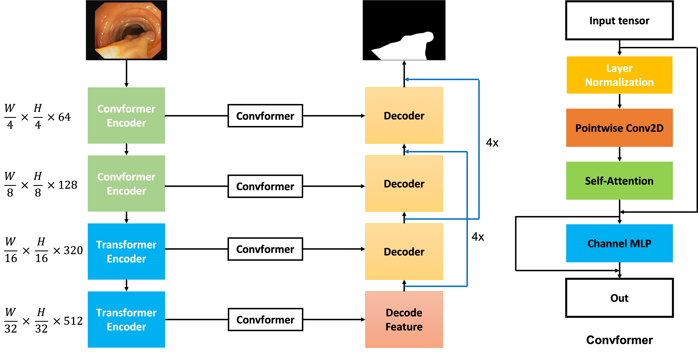
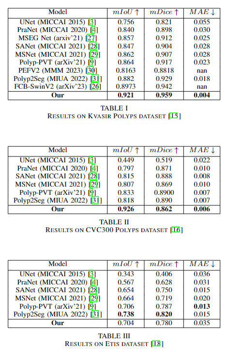
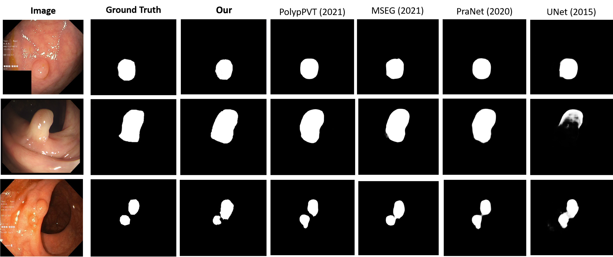

# Meta-Polyp: a baseline for efficient Polyp segmentation, CBMS 2023 

This repo is the official implementation for paper:

Meta-Polyp: a baseline for efficient Polyp segmentation.

<b>Author:</b> <b>Quoc-Huy Trinh</b>

In the IEEE 36th International Symposium on Computer Based Medical Systems (CBMS) 2023.

Detail of each model modules can be found in original paper. Please citation if you use our implementation for research purpose.

## Overall architecture

Architecutre Meta-Polyp baseline model:

<div align="center">
    <a href="./">
        
    </a>
</div>

## Installation

Our implementation is on ``` Python 3.9 ``` , please make sure to config your environment compatible with the requirements.

To install all packages, use ``` requirements.txt ``` file to install. Install with ```pip ``` by the following command:

```
pip install -r requirements.txt
```

All packages will be automatically installed.

## Config

All of configs for training and benchmark are in ```./config/``` folder. Please take a look for tuning phase.

## Training

For training, use ``` train.py ``` file for start training.

The following command should be used:

```
python train.py
```

## Benchmark 

For benchmar, use ```benchmark.py``` file for start testing.

The following command should be used:

```
python benchmark.py
```

<b>Note:</b> <i>You should fix model_path for your model path and directory to your benchmark dataset.</i>
 

## Pretrained weights

The weight will be update later.

## Dataset

In our experiment, we use the dataset config from (PraNet)[https://github.com/DengPingFan/PraNet], with training set from 50% of Kvasir-SEG and 50% of ClinicDB dataset. 

With our test dataset, we use the following:

In same distribution:

- Kvasir SEG

- ClinicDB 


Out of distribution:

- Etis dataset

- ColonDB

- CVC300


## Results

The IOU score on SOTA for both 5 datasets: 

<div align="center">
    <a href="./">
        
    </a>
</div>

## Visualization
We do some qualiative result with others SOTA method visualization:

<div align="center">
    <a href="./">
        
    </a>
</div>

## Weights

Coming soon

## Customize
You can change the backbone from Ca-former to PVT or something else to get different results.

## Citation

```
Coming soon
```

